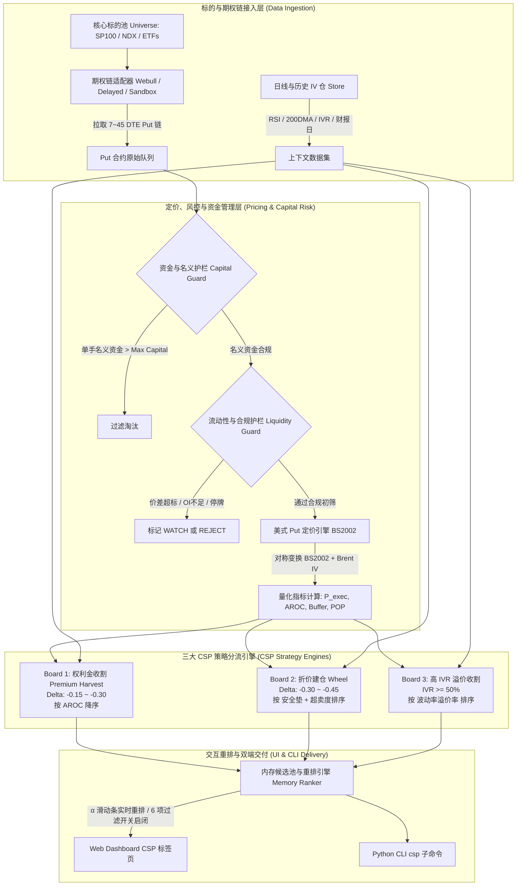

# Cash Secured Put (CSP) 卖方期权量化扫描系统实施计划

本计划旨在现有的 LEAPS Call 扫描系统架构之上，无缝扩展 **Cash Secured Put (CSP / 卖方现金担保沽购期权)** 量化扫描能力。系统支持 7~45 DTE 目标区间，提供三大独立策略看板，集成 6 项用户级可开关过滤器，并引入严格的足额现金担保与名义资金风控护栏。

---

## 1. 需求澄清纪要 (Grill-me Alignment)

根据前期与用户的深入 Socratic 对话，核心业务与架构决策已完全锁定：
1. **三大核心策略全量支持**：
   - **Board 1: 纯权利金收割 (Premium Harvesting)**：追求高胜率与高年化资本回报率（AROC），深度虚值 OTM，Delta 位于 \(-0.15 \sim -0.30\)。
   - **Board 2: 折价建仓 / Wheel 轮动 (Dip-Buying / Wheel)**：看重下行安全垫与盈亏平衡点，偏向平值附近或适度虚值，Delta 位于 \(-0.30 \sim -0.45\)，针对低估值/技术面超卖的优质底仓标的。
   - **Board 3: 高 IVR 波动率溢价收割 (High IV Rank Harvest)**：专门捕捉隐含波动率显著高于历史波动的标的（IV Rank / IV Percentile \(\ge 50\%\)），赚取波动率均值回归与加速 Theta 衰减。
2. **到期期限 (DTE) 覆盖**：
   - 支持 **7 ～ 45 DTE**，无缝涵盖「7~21 天短周高频复利」与「30~45 天经典 Theta 加速衰减」两大黄金交易区间。
3. **量化指标与 6 项可开关过滤器 (Toggleable Filters)**：
   - 全部指标就绪，并在 Web UI 与 CLI 提供独立开关，用户可按需自由启闭：
     1. 年化资本回报率门槛 (\(\text{AROC} \ge \text{Min AROC}\))
     2. 下行安全垫门槛 (\(\text{Downside Buffer} \ge \text{Min Buffer}\))
     3. 隐含波动率分位门槛 (\(\text{IV Rank} \ge \text{Min IVR}\))
     4. 胜率估算门槛 (\(\text{POP} \ge \text{Min POP}\))
     5. 财报日预警护栏 (Earnings Risk Gate: DTE 跨越财报日时标记预警或过滤)
     6. 流动性硬门槛 (买卖价差 Spread 占比、成交量 Volume、持仓量 Open Interest)
4. **系统工程整合**：
   - 深度融入现有 LEAPS Scanner 代码库，复用 Sandbox/Delayed/Webull 数据流、底层数学引擎与 FastAPI 服务，在 Web Dashboard 新增 CSP 策略标签页。
5. **资金与名义风控护栏 (Capital Guardrails)**：
   - 支持设置单手名义资金上限（\(\text{Strike} \times 100 \le \text{Max Capital}\)）。
   - 根据用户填写的总可用现金池（Total Cash Pool），自动换算并展示推荐开仓手数：
     $$\text{Recommended Contracts} = \left\lfloor \frac{\text{Total Cash}}{\text{Strike} \times 100} \right\rfloor$$

---

## 2. Ponytail 极简复用与反臃肿审查 (Code Reuse Audit)

秉承 **Ponytail (敏捷、极简、杜绝过度工程)** 原则，对全库进行了逐层审查，严禁重复造轮子：

| 功能层级 | 现有能力 | Ponytail 复用方案 | 削减掉的冗余工作 (Skipped Bloat) |
| :--- | :--- | :--- | :--- |
| **美式期权定价** | `bjerksund_stensland_2002` 美式 Call 闭式解 | **利用 Bjerksund-Stensland 对称性恒等式**：<br>\(\text{AmericanPut}(S, K, T, r, q, \sigma) = \text{AmericanCall}(K, S, T, q, r, \sigma)\)<br>直接通过入参对调实现美式 Put 定价，只需 5 行代码包装！ | 避免重新编写/移植上千行的二叉树或全新 Put 偏微分方程求解器。 |
| **欧式期权基准** | `black_scholes_call` 欧式 Call 闭式解 | 同样利用对称性或经典 Put 公式：<br>\(\text{BS\_Put}(S, K, T, r, q, \sigma) = \text{BS\_Call}(K, S, T, q, r, \sigma)\) | 零重复公式推导与浮点边界调试。 |
| **敏感度 Greeks** | `greeks.py` 有限差分引擎 | 复用有限差分框架，仅需适配 Put 的负 Delta 约束 (\(-1.0 \le \Delta \le 0.0\)) 与正卖方 Theta。 | 无需引入 SciPy、QuantLib 等重型依赖库。 |
| **IV 反推求解器** | `iv_solver.py` 的 `_brent_root` 与无套利边界截断 | 传入 `bjerksund_stensland_put` 作为目标目标函数，完全复用 Brent 算法与无套利约束。 | 零重复开发数值求根逻辑。 |
| **卖方执行价模型** | `metrics.py` 的滑点模型 | 现有买方公式：\(P_{exec} = \text{mid} + \alpha(\text{ask} - \text{mid})\)<br>卖方对称公式：\(P_{exec} = \text{mid} - \alpha(\text{mid} - \text{bid})\)<br>仅需增加 `side="SELL"` 参数即可统一。 | 杜绝单独维护两套不一致的滑点计算器。 |
| **数据拉取层** | `public_delayed.py` 与 `webull.py` | Nasdaq 接口原生带有 `p_Bid, p_Ask, p_Openinterest, p_Volume`；Webull 接口原生支持 `option_type="PUT"`。只需增加类型开关。 | 避免重写数据连接器、限频器或缓存逻辑。 |
| **标的池与历史仓** | `universe.py`、`daily_bars.py`、`iv_history.py` | 100% 完全复用现有的标的集合、技术面指标（RSI, 200DMA）与历史 IV 数据库。 | 零额外存储与历史抓取开销。 |
| **流动性风控** | `guards.py` 中的 `evaluate_liquidity_guard` | Spread / OI / Volume 门禁评分体系完全复用。 | 零重复代码。 |

---

## 3. 架构与全流程设计 (Workflow & Architecture)

已通过 `archify` 编译交付独立的交互式流程可视化文件：
- **交付产物**：[docs/csp-workflow-zh.html](../docs/csp-workflow-zh.html)
- **规格文件**：[docs/csp-workflow.workflow.zh.json](../docs/csp-workflow.workflow.zh.json)
- **Showcase 验收状态**：9/9 校验项全部通过，0 错误，0 警告。

### 端到端数据流与决策流拓扑 (Mermaid)



---

## 4. 量化数学模型与核心指标定义

### 4.1 卖方执行价滑点模型 (Sell-side P_exec)
对于期权卖方，挂单在买一价（Bid）是最保守的极端即时成交状态，挂单在中间价（Mid）是最理想状态。引入执行滑点因子 \(\alpha \in [0, 1]\)（默认 \(\alpha = 0.5\)）：
$$P_{\text{exec}} = \text{Mid} - \alpha \times (\text{Mid} - \text{Bid}) = \text{Bid} + (1 - \alpha) \times (\text{Mid} - \text{Bid})$$
- 当 \(\alpha = 0\) 时，预期按 \(\text{Mid}\) 理想价格成交。
- 当 \(\alpha = 1\) 时，预期按 \(\text{Bid}\) 最恶劣价格成交。
- 确保权利金收益绝不虚高估算。

### 4.2 年化资本回报率 (Annualized Return on Capital, AROC)
在足额现金担保的前提下，每张合约需冻结现金 \(\text{Strike} \times 100\)，收取的期权权利金为 \(P_{\text{exec}} \times 100\)：
$$\text{AROC} = \frac{P_{\text{exec}}}{\text{Strike}} \times \frac{365}{\text{DTE}}$$

### 4.3 下行安全垫与盈亏平衡点 (Downside Buffer & Break-even)
- **盈亏平衡点**：\(\text{Break-even} = \text{Strike} - P_{\text{exec}}\)
- **下行安全垫比例 (Downside Buffer)**：标的现价距离行权价的安全边际：
$$\text{Downside Buffer} = \frac{\text{Spot} - \text{Strike}}{\text{Spot}}$$
- **至盈亏平衡点的下行空间**：
$$\text{Buffer to Break-even} = \frac{\text{Spot} - (\text{Strike} - P_{\text{exec}})}{\text{Spot}}$$

### 4.4 胜率估算 (Probability of Profit, POP)
- **Delta 逼近法**：对于卖出 Put，行权概率约为 \(|\Delta|\)，到期虚值归零（获利）概率约为：
$$\text{POP}_{\Delta} = 1 - |\Delta|$$
- **Black-Scholes 积分法**（至 Break-even 点的胜率）：
$$\text{POP}_{\text{BE}} = \Phi\left( \frac{\ln(\text{Spot} / \text{Break-even}) + (r - q - 0.5\sigma^2)T}{\sigma\sqrt{T}} \right)$$

### 4.5 资金与推荐手数 (Capital Sizing)
用户输入可用现金池 \(C_{\text{total}}\)（如 \$50,000）：
$$\text{Required Capital per Contract} = \text{Strike} \times 100$$
$$\text{Recommended Contracts} = \left\lfloor \frac{C_{\text{total}}}{\text{Strike} \times 100} \right\rfloor$$
$$\text{Total Premium Harvested} = \text{Recommended Contracts} \times P_{\text{exec}} \times 100$$

---

## 5. 详细实现组件划分 (Proposed Changes)

### 核心计算层 (Core Layer)

#### [MODIFY] [american_pricing.py](../src/leaps_scanner/core/american_pricing.py)
- 新增 `black_scholes_put(spot, strike, t, r, q, sigma)`：通过 `black_scholes_call(strike, spot, t, q, r, sigma)` 实现。
- 新增 `bjerksund_stensland_put(spot, strike, t, r, q, sigma)`：通过 `bjerksund_stensland_2002(strike, spot, t, q, r, sigma)` 严格实现美式 Put 定价。

#### [MODIFY] [greeks.py](../src/leaps_scanner/core/greeks.py)
- 新增 `calculate_american_put_greeks(spot, strike, t, r, q, sigma) -> AmericanGreeks`：
  - Delta 严格钳制在 \([-1.0, 0.0]\)。
  - Gamma 严格非负。
  - Theta 对卖方展现为正向每日时间收益。

#### [MODIFY] [iv_solver.py](../src/leaps_scanner/core/iv_solver.py)
- 新增 `solve_american_put_iv(spot, strike, t, r, q, market_price)`，复用 `_brent_root` 与无套利下界检查。

#### [MODIFY] [metrics.py](../src/leaps_scanner/core/metrics.py)
- 扩展 `calculate_pexec` 支持 `side="SELL"`（或新建 `calculate_sell_pexec(bid, ask, alpha=0.5)`）。
- 新增 `calculate_aroc(pexec, strike, dte) -> float`。
- 新增 `calculate_downside_buffer(spot, strike) -> float`。
- 新增 `calculate_pop(delta, spot=None, breakeven=None, ...) -> float`。
- 新增 `calculate_recommended_contracts(cash_pool, strike) -> int`。

---

### 数据与筛选层 (Data & Filter Layer)

#### [MODIFY] [public_delayed.py](../src/leaps_scanner/data/public_delayed.py)
- 增强 `parse_nasdaq_chain`，支持 `option_type="C" | "P"` 与参数化 `min_dte`、`max_dte`（默认 CSP 为 7~60 天，LEAPS 为 250+ 天）。
- 提取 `p_Bid`、`p_Ask`、`p_Openinterest`、`p_Volume`。

#### [MODIFY] [webull.py](../src/leaps_scanner/data/webull.py)
- 扩展 `WebullAdapter` 请求期权链时支持传入 `option_type="PUT"`。
- 在离线 sandbox 生成器中增加 CSP 合约合成支持（DTE 7~45 天，OTM Put）。

---

### 策略与排名引擎 (Strategies & Scoring)

#### [NEW] [csp_harvest.py](../src/leaps_scanner/strategies/csp_harvest.py)
- 策略 1: 纯权利金收割逻辑评估（Delta \(-0.15 \sim -0.30\)，AROC 最大化）。

#### [NEW] [csp_wheel.py](../src/leaps_scanner/strategies/csp_wheel.py)
- 策略 2: 折价建仓 / Wheel 轮动评估（Delta \(-0.30 \sim -0.45\)，看重安全垫与低估值/超卖共振）。

#### [NEW] [csp_vol_rank.py](../src/leaps_scanner/strategies/csp_vol_rank.py)
- 策略 3: 高 IVR 波动率收割评估（IV Rank \(\ge 50\%\)，收割肥美权利金）。

#### [NEW] [csp_ranker.py](../src/leaps_scanner/scoring/csp_ranker.py)
- 定义 `CSPCandidate` 数据结构与 6 项开关过滤器配置对象 `CSPFilterConfig`。
- 实现针对 3 个看板的即时重排函数：
  - `rank_csp_harvest(...)`
  - `rank_csp_wheel(...)`
  - `rank_csp_vol_rank(...)`

---

### API 与界面交付层 (API & Delivery Layer)

#### [MODIFY] [server.py](../src/leaps_scanner/api/server.py)
- 新增 `/api/csp/boards` 与 `/api/csp/rerank` 路由（支持总资金池、单手上限与 6 项开关过滤器参数传递）。

#### [MODIFY] [cli.py](../src/leaps_scanner/cli.py)
- 新增 `--strategy-family leaps|csp`（默认 leaps，可切 csp）。
- 支持 CSP 专属筛选参数：`--min-aroc`, `--min-buffer`, `--max-capital`, `--cash-pool`。

#### [MODIFY] [index.html](../src/leaps_scanner/api/static/index.html)
- 顶部导航栏增加切换按钮：`[ 🦅 LEAPS Call 扫描器 ]` 与 `[ 🛡️ Cash-Secured Put 扫描器 ]`。
- 切换至 CSP 视图时，动态展现：
  - 三个专属策略 Tab：`权利金收割` · `折价建仓 / Wheel` · `高 IVR 溢价`
  - 资金输入框：`可用现金总额 ($)` · `单手名义资金上限 ($)`
  - 6 个即时开关过滤药丸按钮 (Pill Toggles)：`年化回报率` · `安全垫` · `高IVR` · `高胜率` · `财报避障` · `流动性门槛`
  - 专属表格列：`Strike (K)` · `行权担保金` · `P_exec` · `年化 AROC` · `下行安全垫` · `胜率 POP` · `推荐手数` · `预期总收益`

---

## 6. 验证与 TDD 实施计划 (Verification Plan)

### 自动化单元测试 (Automated Hermetic Tests)
针对每个改动模块，严格采用 TDD 红绿循环，在 `tests/python/` 补充测试用例：
1. `tests/python/test_american_put_pricing.py`：
   - 验证美式 Put 定价的物理边界：\(\max(0, K - S) \le P_{\text{amer}} \le K\)。
   - 验证美式 Put 永远大于等于欧式 Put。
   - 验证 Bjerksund-Stensland 对称性精度。
2. `tests/python/test_put_greeks_iv.py`：
   - 验证 Put Delta \(\in [-1.0, 0.0]\)，Gamma \(\ge 0\)。
   - 验证 Brent IV 求解器对于 OTM/ITM Put 的收敛率与鲁棒性。
3. `tests/python/test_csp_metrics_guards.py`：
   - 验证 AROC 计算准确性（例：\$100 行权价，\$2 权利金，30 DTE \(\rightarrow \text{AROC} \approx 24.33\%\)）。
   - 验证卖方 \(P_{\text{exec}}\) 滑点（\(\alpha = 0.5\) 位于 Mid 与 Bid 正中间）。
   - 验证单手资金上限与总资金手数向下取整约束。
4. `tests/python/test_csp_ranker.py`：
   - 验证三大策略榜单的打分规则。
   - 验证 6 项过滤器在 True/False 切换时的正确生效（过滤 / 放行）。
5. `tests/python/test_csp_api_cli.py`：
   - 验证 API 端点数据返回格式与 0KB 重排响应时间（\(<1\text{ms}\)）。

执行命令：
```bash
PYTHONPATH=. python -m unittest discover -s tests/python -v
```

---

## 7. Red-Team 对抗审查与正式质询裁决 (Phase 1 Inquest Record)

独立红队审查员（Adversarial RFC Reviewer）已出具正式《方案红队质询函》（Design Adversarial Inquest），下达 **【CONDITIONAL REJECTION】**，共质询 4 项阻断性缺陷（BLOCKER）与 4 项严重隐患（CONCERN）。

蓝队（Blue Team）已全盘接纳质询意见，并正式签署如下 10 项具身性防御条款（Defensive Clauses DC-CSP-1 ~ DC-CSP-10），已全量并入本方案实施契约中。

---

## 8. Red-Team Adversarial Inquest & Defensive Clauses (红队质询应答与防御条款)

### 条款 DC-CSP-1: 美式 Put 物理双界约束与数值平滑防发散 (针对 BLOCKER 1)
- **风险源**：BS2002 对称性公式入参对调在 \(r=0\) 或 \(q=0\) 时，容易误触 Call 模型的 `(q * t) <= 1e-7` 提前退出分支或判别式分母舍入误差。
- **防御契约**：
  1. `bjerksund_stensland_put` 严禁裸调 Call 函数，必须封装数值调理层：
     `r_safe = max(float(r), 1e-6)`, `q_safe = max(float(q), 1e-6)`。
  2. 强制施加美式 Put 无套利物理双界截断：
     $$P_{\text{amer\_put}} = \min(K, \max(0.0, K - S, P_{\text{eur\_put}}, P_{\text{amer\_raw}}))$$
  3. 欧式下界 \(P_{\text{eur\_put}}\) 通过解析公式 `black_scholes_put` 直接计算，若底层数值求解发生异常或 `NaN`，安全降级至 \(\max(K - S, P_{\text{eur\_put}})\)。

### 条款 DC-CSP-2: 7~45 DTE 离散分红事件窗口校准 (针对 CONCERN 2)
- **风险源**：7~45 DTE 短周期将年化分红平滑为连续分红率 \(q\)，若除息日在 DTE 之外会导致虚高估算远期贴现与 Put 理论价值。
- **防御契约**：
  1. 标的若提供离散除息日（Ex-dividend Date）：
     - 若 `ex_date > expiry`：判定该 DTE 周期内无分红事件，定价模型强制置 \(q = 0.0\)；
     - 若 `ex_date <= expiry`：按现值扣减现货价格 \(S' = \max(0.01, S - D \cdot e^{-r t_d})\)，使用无红利美式模型定价。
  2. 若标的仅有历史静态 trailing yield 且除息日不可考，对 7~45 DTE 施加衰减因子，防止连续红利对远期价格造成过度扭曲。

### 条款 DC-CSP-3: 气密性 Put 希腊字母与负 Delta 强制隔离 (针对 BLOCKER 3)
- **风险源**：现有公共数据解析器中存在 Call 正向 Delta 的兜底逻辑，若 IV 无法反解，会将 Put 误标为正 Delta。
- **防御契约**：
  1. `calculate_american_put_greeks` 必须独立实现，对有限差分计算结果施加物理符号硬截断：
     $$\Delta_{\text{put}} \in [-1.0, 0.0], \quad \Gamma_{\text{put}} \ge 0.0$$
  2. Put 专属异常兜底公式：
     $$\Delta_{\text{put\_fallback}} = -\max\left(0.05, \min\left(0.95, 0.5 - 0.5 \times \frac{S - K}{\max(S, 1.0)}\right)\right)$$
  3. 彻底阻断任何正 Delta 污染进入 CSP 策略候选池。

### 条款 DC-CSP-4: AROC 硬下界门槛、双指标展示与 Gamma 风险惩罚 (针对 BLOCKER 4)
- **风险源**：\(\text{DTE} \le 0\) 零除，以及 1~3 天超短末日轮产生天文数字级 AROC 虚假繁荣，导致 Board 1 被高 Gamma 风险垃圾合约垄断。
- **防御契约**：
  1. 建立硬防线：`DTE < 7` 直接触发 `GuardStatus.REJECT`，拒绝对其进行 AROC 估值；计算分母施加保护：`dte_safe = max(dte, 7.0)`。
  2. 双指标并行：在 API、CLI 与前端同时输出：
     - 单期真实资本回报率：\(\text{ROC} = P_{\text{exec}} / \text{Strike}\)（直观展现本期真实落袋比例）
     - 年化回报率：\(\text{AROC} = \text{ROC} \times (365 / \text{dte\_safe})\)
  3. Board 1 排序引入 Gamma 风险折价：对于 \(\text{DTE} < 21\) 的短合约，要求下行安全垫 \(\ge 3.0\%\) 或对其 AROC 施加平滑惩罚，杜绝末日轮虚假霸榜。

### 条款 DC-CSP-5: 胜率标识明确化与下行极端压力测试 (针对 CONCERN 5)
- **风险源**：高斯正态分布低估单票厚尾与跳空暴跌，简单宣称 85%+ 胜率产生“火鸡幻觉”。
- **防御契约**：
  1. 指标命名严格规范为 `POP (Delta Approx)` 与 `POP (LogNormal)`，并在 UI 提示框明确注明“该胜率基于理论模型估算，不包含财报跳空与极端黑天鹅风险”。
  2. 在 CSP 详情与导览中引入「极端情景压力测试指标（Stress Test Drop -15%）」：
     $$\text{Stress PnL (15% Drop)} = 100 \times \left(P_{\text{exec}} - \max(0.0, K - S \times 0.85)\right)$$
     直观呈现一旦标的单日跳空暴跌 15% 时每手面临的真实浮亏。

### 条款 DC-CSP-6: 零买盘（Zero Bid）一票否决与卖方深度滑点 (针对 BLOCKER 6)
- **风险源**：当 `Bid = 0.0` 时虚假计算正向 Mid 与 \(P_{\text{exec}}\)；卖方滑点错用买方 `ask_size` 校验深度。
- **防御契约**：
  1. 一票否决硬门槛：若 `bid <= 0.0`、`bid_size <= 0` 或 `bid >= ask`（行情倒挂），立即判定为 `GuardStatus.REJECT`（原因：`INVALID_OR_ZERO_BID`），绝不允许参与 \(P_{\text{exec}}\) 和 AROC 计算。
  2. 卖方专属执行价滑点逻辑：
     $$P_{\text{exec}} = \text{Mid} - \alpha \times (\text{Mid} - \text{Bid})$$
     严格保证物理边界：\(\text{Bid} \le P_{\text{exec}} \le \text{Mid}\)。
  3. 卖方买盘深度衰减：若买一深度 `bid_size < target_contracts`，自动将有效滑点因子惩罚性提升：`effective_alpha = max(effective_alpha, 0.85)`。

### 条款 DC-CSP-7: 单标的暴露集中度上限与全额最大亏损透明度 (针对 CONCERN 7)
- **风险源**：直接按全账户可用现金换算单标的手数，导致 100% 仓位集中于单只股票；未展示 Max Loss。
- **防御契约**：
  1. 引入单标的名义暴露敞口上限参数 `--max-underlying-exposure-pct`（默认 25%，可配置 10%~50%）。
  2. 推荐开仓手数计算公式升级为：
     $$\text{Max Ticker Capital} = C_{\text{total}} \times \text{Exposure Pct}$$
     $$\text{Recommended Contracts} = \min\left(\left\lfloor \frac{\text{Max Ticker Capital}}{K \times 100} \right\rfloor, \left\lfloor \frac{C_{\text{total}}}{K \times 100} \right\rfloor\right)$$
  3. 全看板显式计算并渲染每手及总持仓的真实最大潜在亏损（Max Potential Loss）：
     $$\text{Max Loss per Contract} = (K - P_{\text{exec}}) \times 100$$
     $$\text{Total Position Max Loss} = \text{Recommended Contracts} \times (K - P_{\text{exec}}) \times 100$$

### 条款 DC-CSP-8: 财报状态三态枚举与非静默降级徽章 (针对 BLOCKER 8)
- **风险源**：延迟数据源缺乏财报日历，导致【财报避障】开关静默放行雷区或一刀切全清。
- **防御契约**：
  1. 定义严密的财报状态三态枚举（Ternary Enum）：
     - `CONFIRMED_SAFE`：官方日历证实 DTE 周期内无财报；
     - `EARNINGS_IMPACTED`：已确认 DTE 周期内存在财报发布；
     - `EARNINGS_UNVERIFIED`：数据源不可考或离线沙盒无日历数据。
  2. 当处于 `EARNINGS_UNVERIFIED` 时，前端界面与 CLI 必须强制打上黄色预警标签 `[Earnings: Unverified]`，绝不伪装为 Safe。
  3. 【财报避障】开关默认拦截 `EARNINGS_IMPACTED`，并在配置中支持 `--strict-earnings`（严格模式：连同未核验标的一并过滤）。

### 条款 DC-CSP-9: 动静分离排重与前端请求防抖 (针对 CONCERN 9)
- **风险源**：用户连续拖拽滑块或狂点 6 个开关按钮，导致服务端内存频繁迭代上千对象引发 GC 尖刺。
- **防御契约**：
  1. **动静解耦**：初筛阶段固化静态字段（Strike, Spot, DTE, Delta, IVR, Liquidity），动态重排仅对过滤后的活跃子集进行 \(\alpha\) 关联指标（\(P_{\text{exec}}\), AROC, POP, 手数）轻量计算。
  2. **前端防抖**：Web 端的滑块与过滤药丸交互强制增加 250ms 防抖（Debounce），并配备 `AbortController`，在发送新重排请求前自动取消未完成的在途请求。

### 条款 DC-CSP-10: 线程安全与不可变快照指针原子替换 (针对 CONCERN 10)
- **风险源**：后台拉取最新期权链与前端重排并发执行，存在全局变量脏读。
- **防御契约**：
  1. `AppState` 中的候选集更新统一采用不可变数据类 `CSPBoardSnapshot`。
  2. 刷新流程在后台组装完整快照后，通过单一引用赋值进行原子替换（Atomic Pointer Swap），全程杜绝迭代进行中的就地修改。
